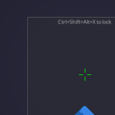
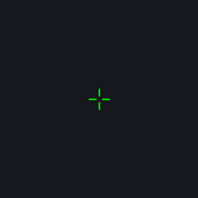
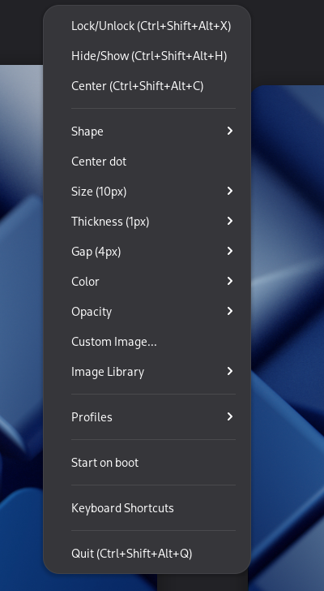
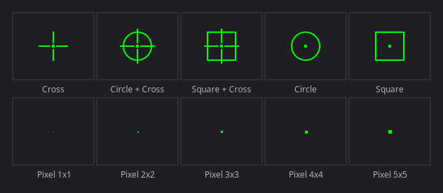
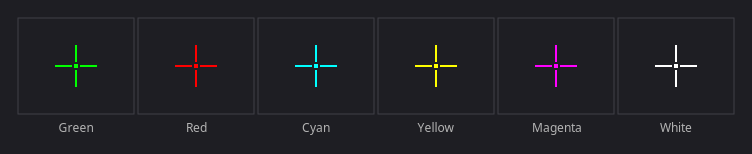

# CrossOver GTK

A lightweight crosshair overlay for Linux (X11 + Wayland). Built with GTK3 and Cairo.

Designed for FPS games (CS2, Valorant, etc.) where you need a persistent crosshair overlay.

<p align="center">
  
  &nbsp;&nbsp;
  
  &nbsp;&nbsp;
  
</p>

### Crosshair styles

<p align="center">
  
</p>

### Color presets

<p align="center">
  
</p>

## Features

- Transparent, always-on-top, click-through overlay
- Multiple crosshair styles: cross, pixel (1x1 to 5x5), circle, square, and combinations
- Modular: combine dot, cross, circle, square independently
- Custom crosshair images (PNG/SVG)
- Per-game position profiles
- Configurable color, opacity, size, thickness, gap
- System tray icon with full configuration menu
- GNOME keyboard shortcuts for all actions
- Numpad-based pixel-precise positioning (1px and 10px steps)
- Autostart on boot
- Wayland support via gtk-layer-shell, with an XWayland fallback on GNOME
- ~5 MB RAM, 0% CPU

## Install

### From .deb package

Download the latest `.deb` from the
[Releases page](https://github.com/packerlschupfer/crossover-gtk/releases/latest):

```bash
sudo dpkg -i crossover-gtk_*_all.deb
sudo apt-get install -f      # if any dependency is missing
```

### Manual (Debian/Ubuntu)

```bash
sudo apt install python3-gi python3-gi-cairo gir1.2-gtk-3.0 gir1.2-ayatanaappindicator3-0.1
# Optional Wayland support:
sudo apt install gir1.2-gtklayershell-0.1
git clone https://github.com/packerlschupfer/crossover-gtk.git
cd crossover-gtk
./crossover.py
```

### Arch Linux

```bash
sudo pacman -S python-gobject gtk3 libayatana-appindicator
# Optional Wayland support:
sudo pacman -S gtk-layer-shell
git clone https://github.com/packerlschupfer/crossover-gtk.git
cd crossover-gtk
./crossover.py
```

### GNOME Wayland note

On GNOME the overlay runs on **XWayland**. GNOME's compositor implements neither
layer-shell nor always-on-top for Wayland windows, so a native Wayland overlay
disappears behind whatever you Alt+Tab to; XWayland honours `_NET_WM_STATE_ABOVE`,
and it also restores exact positioning and drag-to-move. This is automatic — set
`CROSSOVER_NO_XWAYLAND=1` to force a native Wayland window instead. Compositors
that do support layer-shell (wlroots, KWin) keep using it.

GNOME does not show tray icons by default. Install the [AppIndicator extension](https://extensions.gnome.org/extension/615/appindicator-support/) to get the system tray icon:

```bash
# Debian/Ubuntu/Bazzite
sudo apt install gnome-shell-extension-appindicator
# Fedora
sudo dnf install gnome-extensions-app gnome-shell-extension-appindicator
```

Then enable it in GNOME Extensions and log out/in.

## Usage

```bash
crossover-gtk                    # Start the overlay
crossover-gtk --install-keys     # Register GNOME keyboard shortcuts
crossover-gtk --uninstall-keys   # Remove GNOME keyboard shortcuts
crossover-gtk --version          # Show version
crossover-gtk COMMAND            # Send command to running instance
```

### Commands

| Command | Description |
|---------|-------------|
| `lock` | Toggle lock (click-through, hide UI) |
| `hide` | Toggle crosshair visibility |
| `center` | Center on current monitor |
| `quit` | Quit |
| `up`, `down`, `left`, `right` | Nudge 1px |
| `up10`, `down10`, `left10`, `right10` | Nudge 10px |

### Keyboard Shortcuts

After running `crossover-gtk --install-keys`:

| Shortcut | Action |
|----------|--------|
| Ctrl+Shift+Alt+X | Lock/Unlock (click-through, hide UI) |
| Ctrl+Shift+Alt+H | Hide/Show crosshair |
| Ctrl+Shift+Alt+C | Center on current monitor |
| Ctrl+Shift+Alt+Q | Quit |
| Ctrl+Alt+Numpad 8/2/4/6 | Nudge 1px (up/down/left/right) |
| Ctrl+Shift+Alt+Numpad 8/2/4/6 | Nudge 10px |

### Tray Icon

Right-click the system tray icon for:

- Lock/Unlock, Hide/Show, Center
- Style selection (cross, pixel, circle, square, etc.)
- Color presets and custom color picker
- Opacity control (10%-100%)
- Custom crosshair image loading
- Per-game position profiles (save/load/delete)
- Autostart toggle
- Keyboard shortcut reference

## Configuration

Config is stored at `~/.config/crossover-gtk/config.json`. All settings are also accessible from the tray menu.

### Image library

Drop `.png` or `.svg` crosshairs into `~/.config/crossover-gtk/crosshairs/` (or, system-wide, `/usr/share/crossover-gtk/crosshairs/`) and they appear under **Image Library** in the tray menu, grouped by subdirectory.

## Why not Electron?

The original [CrossOver](https://github.com/lacymorrow/crossover) is an Electron app that supports Windows, macOS, and Linux. However, on Linux with X11, Electron's transparent window rendering has fundamental issues — DOM changes don't trigger repaints, and workarounds (hide/show, resize) break transparency.

This GTK3 rewrite is Linux-native, uses ~5MB RAM (vs ~200MB for Electron), and everything just works.

## License

GPL-3.0
